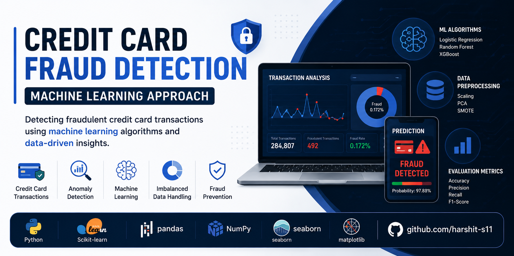

<p align="center">
  
</p>

# 💳 Credit Card Fraud Detection using Machine Learning

<p align="center">


</p>

A machine learning-based fraud detection system developed to identify fraudulent credit card transactions by analyzing transaction patterns and handling highly imbalanced datasets.

The project demonstrates an end-to-end machine learning pipeline including data preprocessing, exploratory data analysis, feature engineering, imbalance handling using SMOTE, model training, evaluation, and explainable AI techniques.

---

# 📖 Project Overview

Financial fraud detection is one of the most important real-world applications of machine learning. Since fraudulent transactions represent only a very small fraction of all transactions, traditional classification models often struggle with severe class imbalance.

This project explores multiple machine learning algorithms and compares their performance in detecting fraudulent credit card transactions while minimizing false positives and improving fraud detection accuracy.

---

# ✨ Features

- Data Cleaning & Preprocessing
- Exploratory Data Analysis (EDA)
- Handling Class Imbalance using SMOTE
- Feature Scaling
- Training Multiple Machine Learning Models
- Model Performance Comparison
- Fraud Prediction
- Explainable AI using SHAP
- Performance Visualization

---

# 🛠 Tech Stack

- Python
- Jupyter Notebook
- NumPy
- Pandas
- Matplotlib
- Seaborn
- Scikit-learn
- Imbalanced-Learn
- XGBoost
- LightGBM
- SHAP

---

# 🤖 Machine Learning Models

- Logistic Regression
- Decision Tree
- Random Forest
- Support Vector Machine (SVM)
- Extra Trees Classifier
- XGBoost
- LightGBM
- Stacking Classifier

---

# 🔄 Machine Learning Pipeline

```text
Transaction Dataset
        │
        ▼
Data Cleaning
        │
        ▼
Exploratory Data Analysis
        │
        ▼
Feature Scaling
        │
        ▼
SMOTE Oversampling
        │
        ▼
Model Training
        │
        ▼
Model Evaluation
        │
        ▼
SHAP Explainability
        │
        ▼
Fraud Prediction
```

---

# 📂 Project Structure

```text
CNS-Fraud-Detection/
│
├── FraudDectectionProject.ipynb
├── requirements.txt
├── banner.png
├── README.md
└── .gitignore
```

---

# 🚀 Getting Started

## Clone the Repository

```bash
git clone https://github.com/harshit-s11/CNS-Fraud-Detection.git
```

---

## Navigate to the Project Directory

```bash
cd CNS-Fraud-Detection
```

---

## Install Dependencies

```bash
pip install -r requirements.txt
```

---

## Launch Jupyter Notebook

```bash
jupyter notebook
```

Open:

```text
FraudDectectionProject.ipynb
```

---

# ▶️ Workflow

1. Load Transaction Dataset
2. Data Cleaning
3. Exploratory Data Analysis
4. Feature Engineering
5. Feature Scaling
6. SMOTE Oversampling
7. Train Multiple Models
8. Compare Model Performance
9. Generate Fraud Predictions
10. Interpret Predictions using SHAP

---

# 📊 Results

The notebook provides comprehensive evaluation including:

- Accuracy
- Precision
- Recall
- F1-Score
- ROC-AUC
- Confusion Matrix
- Model Comparison
- SHAP Explainability Visualizations

---

# 🎯 Learning Outcomes

Through this project, I gained practical experience with:

- Fraud Detection Systems
- Machine Learning Classification
- Imbalanced Dataset Handling
- SMOTE Oversampling
- Feature Engineering
- Explainable AI (SHAP)
- Model Evaluation
- Comparative Performance Analysis

---

# 💼 Applications

- Banking & Finance
- Payment Security
- Fraud Analytics
- Risk Assessment
- Financial Technology (FinTech)
- Machine Learning Research

---

# 🔮 Future Improvements

- Deep Learning-based Fraud Detection
- Real-Time Transaction Monitoring
- Flask/FastAPI Deployment
- Streamlit Dashboard
- Docker Containerization
- Cloud Deployment
- REST API Integration

---

# 📜 License

This project is licensed under the **MIT License**.

---

# 👨‍💻 Author

**Harshit Sharma**

Final-year B.Tech Computer Science Engineering Student

VIT Chennai

🔗 GitHub: https://github.com/harshit-s11

🔗 LinkedIn: https://linkedin.com/in/harshit-sharma24

---

⭐ If you found this repository useful, consider giving it a star.
